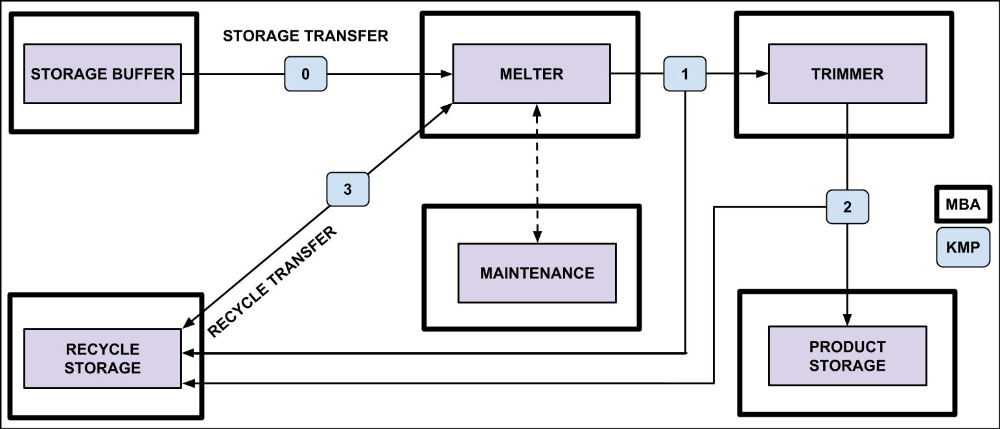
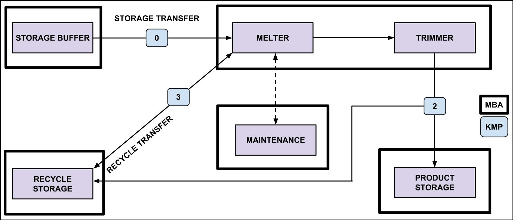

# System Designs

Each folder contains a different design for this subprocess. 

Included  

Removed  

A new folder should be created for any new subprocess design and diagram included here. 

## Version listing

### Fuel fabrication v1.0

This is a 'bare bones' build, just to get the model working.  
Many assumptions are made and listed in the comments.  

### Fuel fabrication v1.1

Upgraded to simulate the melter failure.

### Fuel fabrication v1.2

Upgraded to simulate the melter failure with the Weibull distribution.  
This version is ready for testing cases.

### Fuel fabrication v1.3

Several sensitivity analyses varying facility input parameters were performed to verify the safeguardability of facility designs.  
MUF calculation is optional at each KMP.

### Command and control v1.0  

This file controls directory creation and default input file transfers for all modules.

## Root and simulation directory

Examples with root directory and simulation directory settings are provided below. ‘global_vars.py’ contains ‘root_dir’ and ‘simulation_dir’ variables.

- root_dir = [where the repository is located]/fuel.fabrication.des.model/model.kmp1.included

- simulation_dir = [where the repository is located]/fuel.fabrication.des.model/model.kmp1.included/simulation/[user’s value provided for simulation]

## Execution

Users need to modify the ‘lib’ directory first to specify desired inputs. After changes, ‘simulation.set.up.py’ is run to create a new simulation directory under ‘simulation’. It copies input files from the ‘lib’ directory and pastes them into ‘[simulaton_dir]/fuel.fabrication/input.’ In addition, it helps users to change the root directory and create a readme file for the specific simulation directory created.

- ‘main.py’ is used to execute the 250-day operation one time.

- ‘execution.py’ is used to execute the 250-day operation multiple times. Currently, the model run the simulation 1000 times. To run a different number of simulations, the range specified for the ‘for’ loop in ‘execution<Plug>PeepOpeny’ must be modified.

The ‘output’ directory under ‘[simulaton_dir]/fuel.fabrication’ contains the results from executing ‘main.py.’ The results from executing ‘execution.py’ are stored in ‘[root_dir]/simulation/1000.test.runs.’

## Baseline v equipment

In ‘[where the repository is downloaded and placed on your local machine]/fuel.fabrication.des.model,’ two different directories called ‘model.kmp1.included’ and ‘model.kmp1.removed’ are included. ‘model.kmp1.included’ is for the baseline design, and ‘model.kmp1.removed’ is for the equipment design. 

Some source codes under ‘oo.fuel.fabrication,’ such as ‘facility_command_module.py’ and ‘kmp_measurement_point_module.py’ are modified for the equipment design.

## Sensitivity Analyses

In the ‘final.output/[a specific analysis that user choose]’ directory, the subdirectory called ‘gold’ contain all graphs constructed by performing sensitivity analyses varying false alarm thresholds, failure rate parameter, false alarm probability, heel mean, heel variance, and weight measurement error.

For instance, after running ‘execution.py,’ output in ‘[root_dir]/simulation/1000.test.runs’ were copied and pasted into the ‘final.output/[a specific analysis that user choose]/[parameter variation]’ directory first. Next, by executing ‘campaign.py’, ‘false_alarm.py’, ‘melter_failure.py’, and ‘processed_material.py,’ the results, such as number of campaigns, false alarm probability, number of melter failure, and amount of processed material, were obtained given a particular facility input
parameter variation.

If another analysis other than the listed ones above is chosen by a user, not only it has to be updated in execution files, but also a directory may need to be created for containing new output.

## Auxiliary files

- README.md under the root directory explains the general overview of the current version. 

- The ‘log.txt’ file shows the detailed operation routine and output, such as measured weight, expected weight, operation time, etc. 

- The ‘system.diagram’ directory contains the schematic diagrams and graphs related to the safeguards model. 
- The concept of random sampling is introduced using ‘random.sampling.py’ under ‘unit.testings.’

- ‘unit.testings.py’ is for testing gaussian distribution related to weight measurement or inventory difference. It also monitors melter failure by constructing the probability density function and its cumulative distribution function. 
=======
# DES modeling for the pyroprocessing system

## Overview

The current discrete event simulation (DES) model is developed for implementing strong safeguardability to a commercial-scale fuel fabrication facility. This README provides the precise guidance on how to run a 250-day operation one time or multiple times. In addition, several different sensitivity analyses can be performed by varying facility input parameters such as false alarm threshold, failure rate parameter, false alarm probability, heel amount, etc.

## Discrete event simulation description

- In DES, each 'event' is a 'vertex.'
- There are state changes and/or parameters associated with a vertex.
- State changes are assigning values to a variable or solving an equation.
- Parameters are variables needed to make the state change.
- DES steps discretely in time through each vertex via an 'edge.'
- At each vertex, the equations are run and the state variables change.
- The edges are dynamic and provide logical relationships between events.
- DES should readily lend itself to the modeling of batch systems like pyroprocessing.
- Python is a natural fit for DES due to its modularity.

## Current status

The fuel fabrication process is modeled for two different designs. See the [fuel fabrication README](fuel-fabrication/README.md) for version updates. 

## Contributing

See the [CONTRIBUTING](CONTRIBUTING.md) file for more information. 

## Prerequisite

The current model only supports up to Python2.x. Spyder would be ideal to run the simulation and observe its process. It allows users to edit code and run files using IPython console.

## For developers

All source files are in the ‘src’ directory. Developers must test any functionalities or modification made on source code before the pull request. We need to add a travis file for checks but could use some help.
>>>>>>> master
